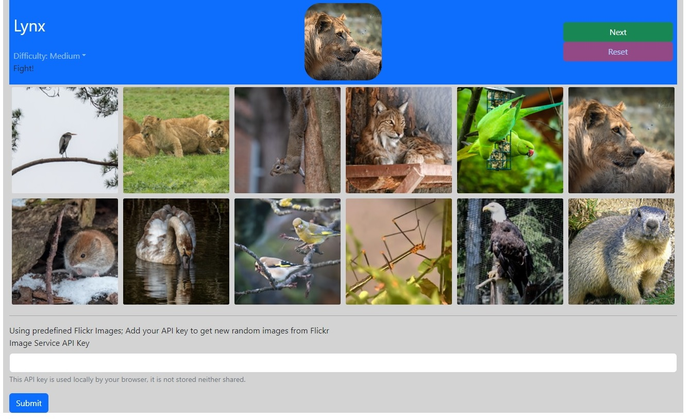

# Web-based, React Lynx game
This application is a client-side only Lynx game. I have designed it as a training subject on my path to learn React.

## Game objective
In this game, a minimum of 2 players compete to be the first to locate a particular image from a set of other images.

## Screenshot

## Usage
`npm install && npm start`

## Design Notes
[Bootstrap](https://getbootstrap.com/) is used for layout. Styles are customized in each components' CSS file.

The game defines 2 React components:

- [Menu](src/Menu.js): menu bar component (bootstrap navbar) with game controls, status
- [Image Grid](src/ImageGrid.js): component to display images in a grid

The game also defines a javascript module to fetch random images from Flickr. To use
it, you need to provide an API key in the form at the bottom of the application.

By default, when no key is provided, a default selection of image is available to test the game.

The design is responsive and uses bootstrap breakpoints to modify the menu appearance in small screens.
